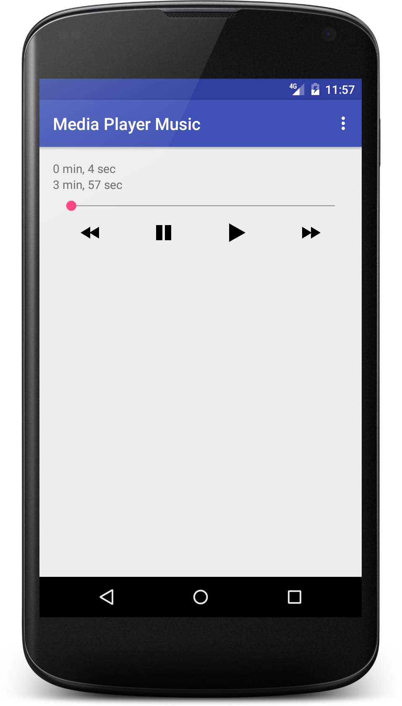

## Android Media Player Music Example
This is an example of playing music in android. Inside there are functions start, pause, backward and forward.
## Screenshot :

### Reference
- [http://www.tutorialspoint.com/android/android_mediaplayer.htm](http://www.tutorialspoint.com/android/android_mediaplayer.htm)